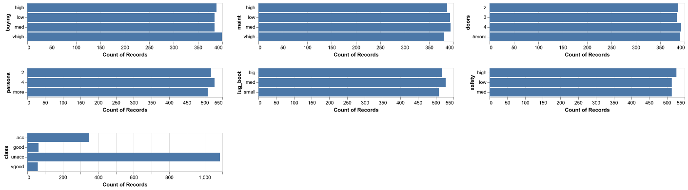
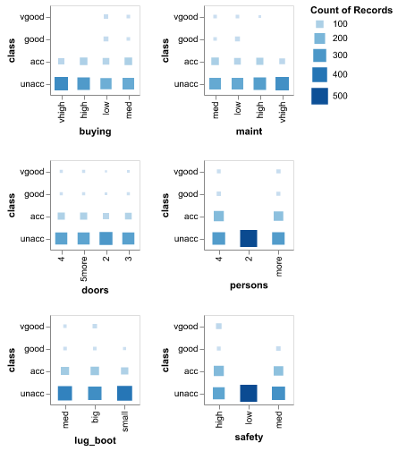

```{r setup, include=FALSE}
knitr::opts_chunk$set(echo = FALSE)
library(tidyverse)
library(knitr)
library(kableExtra)
```

## Summary

With expecting a growing demand on used vehicles in the next years, we are interested to build a classification model to predict the popularity of a given used cars so the model can be used for us to run a used vehicle buying & selling business.

## Introduction

According to the Canadian Press (2021), the Transport Minister of the federal government announced "by 2035, all new cars and light-duty trucks sold in the country will be zero-emission vehicles." This was really an exciting news from tacking climate change perspectives. We embrace the commitment to reach net-zero carbon emissions in Canada. And also with strong business acumen, our team members realized there would be a growing demand on used vehicles for various reasons, such as collection, preference for fossil fuel vehicles, etc. We should get ready to have a robust business plan.

To initialize the business journey, we must educate ourselves on how to evaluate used cars and know which models would be more popular (in other words, will generate better returns on our investment). As current MDS students, we all understand how valuable an data-driven decision making approach is. So the team searched from public accessible data sources and found the 1990s Car Evaluation dataset. Based on the dataset, we have trained and optimized a classification machine learning algorithm to predict how popular a given car model is. This would be much likely to boost our efficiencies when starting to assess a large number of used cars on a daily basis.

## Methods

### Data

The 1990s Car Evaluation dataset utilized in this project was primarily collected in June 1997 by Marko Bohanec to evaluate HINT (Hierarchy INduction Tool), which is presented in B. Zupan, M. Bohanec, I. Bratko, J. Demsar: Machine learning by function decomposition. ICML-97, Nashville, TN. 1997. The original data can be downloaded from the <a href="https://archive-beta.ics.uci.edu/dataset/19/car+evaluation" target="_blank">UC Irvine Machine Learning Repository</a> and follows an <a href="https://creativecommons.org/licenses/by/4.0/legalcode" target="_blank">Creative Commons Attribution 4.0 International License</a>.  

There are 1728 observations in the dataset. Each row represents an individual car with one target and six input attributes. The target includes four classes such as "unacc", "acc", "good", and "vgood". The six input attributes are overall price (buying), price of the maintenance (maint), number of doors (doors), capacity in terms of persons to carry (persons), the size of luggage boot (lug_boot) and the safety of the car (safety).  

### Question of Interest

Our research question is **given attributes of car models from the 1990s, how can we predict the popularity of each car model?**   

This is a straightforward prediction question to be answered based on the representative sample training data, sophisticated machine learning models, and of course some domain experiences from one of our team members. We all agree the research is a critical stepping stone to success in our future business.

### Analysis

The 1990s Car Evaluation dataset has provided us with the privilege to evaluate used vehicle based on six pre-selected categorical attributes. Our objective is to take necessary steps to build a well-performed machine learning model that can give us the best prediction result from the inputs of the six attributes. In order to achieve the objective, the very first step was to read the data, and split the data into training and test sets to ensure the Machine Learning Golden Rule to be followed. Second, we have used some basic `Python` functions from `Pandas` package to quick exam the dataset to know the columns, data types, and if there is any missing value. After getting a higher level understanding of the dataset, a more detailed Exploratory Data Analysis (EDA) has been performed via `Pandas` and `Altair` packages to find correlations and patterns between input attributes and target classes. Then we moved on to the standard machine learning process to build up our prediction model. The process included the necessary feature pre-processing/transformation, pipeline building, classifier tuning, hyperparameters tuning, and final performance assessment by applying Scikit-learn machine learning packages within our defined Python environment.


The raw dataset and our processed data are available to be accessed from <a href="https://github.com/UBC-MDS/Car-Acceptability-Prediction/tree/main/data" target="_blank">here</a>. All the Python code used to perform the analysis can be found at <a href="https://github.com/UBC-MDS/Car-Acceptability-Prediction/tree/main/src" target="_blank">GitHub Car Acceptability Prediction Repository</a>.  

To generate this final report, use `jupyter nbconvert --to notebook --execute <input notebook>` to execute this .ipynb at the command line and render an executed .ipynb after you have forked the <a href="https://github.com/UBC-MDS/Car-Acceptability-Prediction" target="_blank">GitHub repository</a>.

## Results & Discussion

In the EDA stage, we have created two plots to visually explore the distribution of six input attributes together with the target column, and also the counting combinations between input attributes and target classes. From Figure 1 we can see all six input attributes are almost identical distributed, while the classes in the target column are quite imbalanced. Most of the observations are belonging to the class of "unacc". Only a few of them are labeled as "good" or "vgood". This might remind us we have to be careful for the quality of used cars when we start to build our inventory.

```{r figure_1, echo=FALSE, fig.align='center', out.width = '60%', fitfig.cap="Figure 1. Distribution of six input attributes and target"}

```

Figure 2 has been generated to show the counting combinations between six input features and the target. This is similar to the correlation plot that can give us ideas how the input feature related to different classes of target. For example, from the counting combination between the feature of "persons" and the target, we can get an intuition that small cars that only accommodate two people will be more unacceptable. The finding also indicates the feature of "persons" is a meaningful input for models to classify cars into appropriate classes of target.

```{r figure_2, echo=FALSE, fig.align='center', fig.cap="Figure 2. Counting combinations between classes with each feature", out.width = '60%'}

```

Since the raw data was tidy enough our data processing was just focusing on the training/test sets splitting and automatically saving the separate dataframe in the designed data subfolder. Then in the model building stage, we have applied `OrdinalEncoder` transformer to pre-process all six input features, used four different classifiers, `DummyClassifier`, `DecisionTreeClassifier`, `RandomForestClassifier`, and `MultinomialNB` to perform classifier tuning by using `balanced_accuracy` as the scoring metric. The classifier tuning result is shown in Table 1.

```{r table_1, echo=FALSE}
table_1 <- read.csv('../result/car_classifier_tuning_analysis.csv')
knitr::kable(table_1, caption = "Table 1. Classifier tuning results") |>
  kableExtra::kable_styling(full_width = FALSE)
```

From Table 1, we can see `RandomForestClassifier` has the highest test score in this case. Therefore, we decided to select `RandomForestClassifier` as our prediction model and conducted the random search hyperparameter tuning on this classifier. The hyperparamer tuning was focused on two hyperparameters, rf__n_estimators and rf__max_depth.

Table 2 has listed the hyperparameter optimization result. It was sorted by the average test scores. As we can see from Table 2, the test score has been further improved from 0.959 to 0.968, with the best hyperparameters (param_rf__n_estimators equals to 68 and param_rf__max_depth equals to 12). Our selected classifier performed well on training dataset.

```{r table_2, echo=FALSE}
table_2 <- read.csv('../result/car_hyperparameter_tuning_analysis.csv')
knitr::kable(head(table_2), caption = "Table 2. Hyperparameter tuning results")|>
  kableExtra::kable_styling(full_width = FALSE)
```

As the last step in the model building stage, we applied out best model on the test dataset and received the test score with 0.965. It is a rewarding result.


There are some **limitations** and **future improvements** in this analysis that should be highlighted:  

1. The results are based on the input features pre-processing, transformations, model tuning, and hyperparameters optimizations that have been applied in the report. The authors acknowledge that there might be other types of estimators and/or feature engineering methods that have not been considered here but may perform a better prediction.

2. Although the optimistic scores both from the training and test data have been received, considering the size of the dataset is relatively small (1728 observations) and it only contains samples collected in 1990s, we are planning to search more available dataset to let our classifier can generalize better on unseen data before we employ it for our business.

## References


